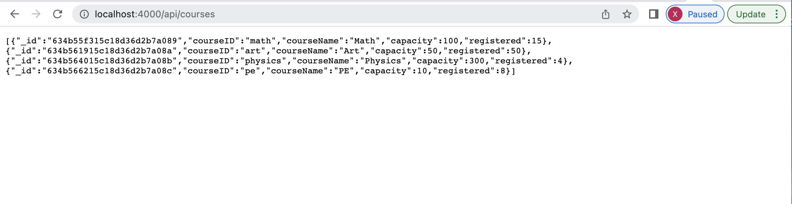
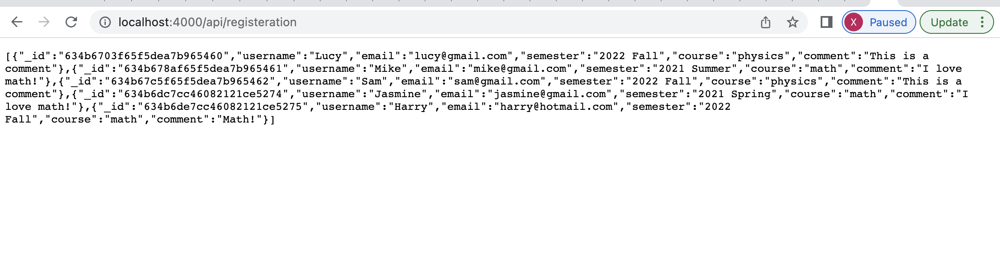
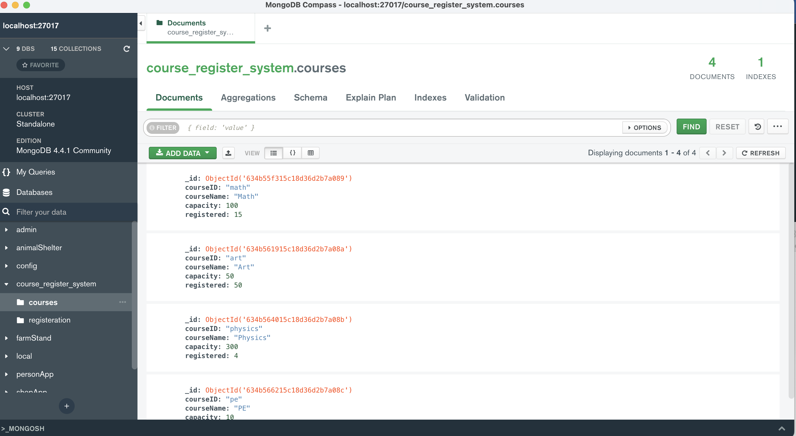
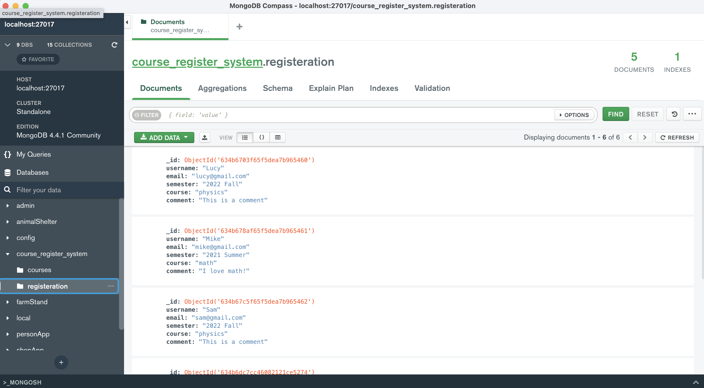

# Getting Started with Create React App

This project was bootstrapped with [Create React App](https://github.com/facebook/create-react-app).

## Available Scripts

In the project directory, you can run:

`npm install react-scripts`
`npm install package.json`
`npm start`

Then the front-end of the project will run on [http://localhost:3000](http://localhost:3000).
You can view it in your browser.

Then in the directory "backend", you can run:
`npm install package.json`
`npm run start`
Then the back-end of the project will run on [http://localhost:4000](http://localhost:4000).

I use the local mongoDB database, which is run on [mongodb://localhost:27017](mongodb://localhost:27017).

## Walkthrough

User input validation

Register a math course

The backend will check the course capacity.
If there are seats to register, we update the number of registered people. (MongoDB database: course_register_system.courses)
We also register the people in the course. (MongoDB database: course_register_system.registration)
The registered/capacity is now updated to 14/100. 
There are 14 people registered to the math course.

Another students want to register the math course.

The registered/capacity is now updated from 14/100 to 15/100.

Some student want to register to the art course.

The art course is at its capacity. We cannot register the course for them.

The backend API, shows the mongoDB database course_register_system.courses

The backend API, shows the mongoDB database course_register_system.registration

MongoDB Compass local databases

